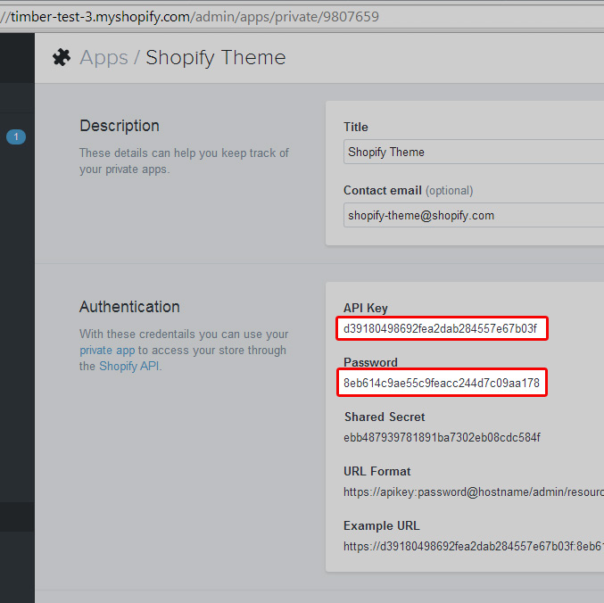
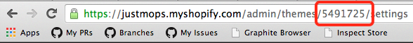

# Edit Your Shopify Theme Locally
[](http://badge.fury.io/rb/shopify_theme)


The Shopify theme gem is a command line tool that allows you to manage and edit theme files directly on your computer. This allows you to use your preferred code editing software opposed to the built in code editor available in the “Edit HTML/CSS” page of your store. Files can be manually or automatically uploaded, downloaded, and synced. Depending on how you develop themes and your personal preference, this can allow for a more enjoyable and streamlined workflow.  If the command line is scary for you, check out the [Desktop Theme Editor app](http://apps.shopify.com/desktop-theme-editor).


## Requirements
This gem works with OS X or Windows with Ruby 1.9.

First time installing Ruby on Windows? Try [Rubyinstaller](http://rubyinstaller.org/).


## Configuration
### Setting up Shopify Theme

First, you will need to set up a new private app to generate an API key and password. Go to **your_store.com**/admin/apps/private in your web browser.

Click on “Create a Private App” to generate the credentials for a new app. You will need the API key and the password of this newly generated app:



Navigate to the directory where you theme files live, or where you'd like them to be, and execute the following command:

`theme configure api_key password store_domain`

**Important:** enter the `store_domain` with no `http://`.

In your directory you should see a file named config.yml with your credentials. If you want, you may also edit the config.yml file directly and paste your API Key and Password in the appropriate area.


### The config.yml File
The config.yml file contains the information needed for Shopify to authenticate requests and edit/update the theme files in the manner specified. Here is an example of what the contents in a typical `config.yml` file would look like:

```yaml
---
:api_key: 7a8da86d3dd730b67a357dedabaac5d6
:password: 552338ce0d3aba7fc501dcf99bc57a81
:store: little-plastics.myshopify.com
:theme_id:
:whitelist_files:
- directoryToUpload/
- importantFile.txt
:ignore_files:
- config/settings.html
```


#### Here is a Breakdown of the Fields:

`api_key`

The API key generated in your private app.

`password`

The password generated in your private app.

`store`

The address of your store (note there is no leading http:// or https://)

`theme_id`

The theme id of the theme that should be responding to commands. If no theme id is specified, the currently active theme will be modified.

`whitelist_files`

Specifies which files and directories should be responding to changes. If nothing is specified, the  `assets/, config/, layout/, snippets/, templates/ and locales/` directories will be modified according to commands entered.

`ignore_files`

Specifies which files should be explicitly ignored and not affected by any commands entered.

### Alternative OAuth configuration (for advanced users)
As of v0.0.23, you can use a Shopify application's OAuth access token to authenticate with a store and manipulate theme files.

Once your application has obtained an access token through Shopify's regular OAuth authentication flow, run the following command to configure the gem:

`theme configure_oauth access_token store_domain`

The gem can then be used in exactly the same way as if you were authenticating via a Private App.

Note that the access token your Application has obtained ***must*** be valid for the `write_themes` scope in order to use the theme gem in this way.


## Commands

`theme download`

Downloads the theme files from your store to your computer.

`theme upload path/to/file`

Uploads a single file to your store. You can also upload directories by using the wildcard character. The command `theme upload assets/*` will upload all files in the assets directory.

`theme remove path/to/file`

Remove a single file from your store. You can also remove directories by using the wildcard character, similar to the theme upload command. The command theme `remove assets/*` will remove all files in the assets directory.  
`theme replace`

**This command can be destructive so it should be used with caution.**

This command replaces all store files with local files; it ensures the store theme files mirrors the files locally.  If you are familiar with FTP or SFTP to upload files to a server, this is similar but not exactly the same. In addition to transferring files, it will delete any theme files in your store that are not present locally.

`theme watch`

Once this command is entered, it continuously monitors files for changes. If a change is detected, it automatically uploads that file to your store. This is similar to [grunt watch](https://github.com/gruntjs/grunt-contrib-watch). To stop theme watch press CRTL + C.  
`theme open`

This command opens your store in the default browser specified on your computer.

`theme bootstrap api_key password store theme_name --version=[version]`

This command is useful if you are starting a brand new theme. It automatically populates your store with a fresh copy of the [Shopify Timber framework](http://shopify.github.io/Timber/).  If you haven’t heard of Timber, it is a theme framework designed for specifically for Shopify themes, made by Shopify. If you enjoy using frameworks like [Bootstrap](http://getbootstrap.com/) or [Foundation](http://foundation.zurb.com/) for your projects, you’ll certainly find Timber useful.

The bootstrap command requires several parameters:

`api_key`

The same API key used in your config.yml file

`password`

The same password used in your config.yml file

`store`

The same store used in your config.yml file

`theme_name`

The name of the theme that will house the Timber framework files. A directory will be created with this name and all theme assets will be copied into it.

**Options**

`--version=[latest]`

This is the only option that you can provide. You can choose any [Timber release](https://github.com/Shopify/Timber/releases) by simply specifying it (i.e. `v2.0.2`). There are two special versions you can use, `master` and `latest`.

- `master` will download the latest build on the Timber master branch.
- `latest` will figure out what the most recent release is and use it.

## Tips and Tricks
### Edit and Preview Inactive Themes
In many cases you may want to work on a theme behind the scenes while your current theme is still active. To accomplish this there are two steps:

* Utilize the theme preview option in your Shopify store. This is a built in feature of Shopify outside the scope of Shopify theme. 
You can find your theme ID by looking at the URL:



## Common Problems
### SocketError or SSL Certificate Validation Error on Windows
If you receive a SocketError or SSL certificate validation error when you try to run any theme command, your install may not have any valid SSL certificates.

In short, you can solve this problem by downloading [this file](http://curl.haxx.se/ca/cacert.pem) and placing it in `C:\RailsInstaller\`. The file should retain the name cacert.pem. Once this is done, run `set SSL_CERT_FILE=C:\RailsInstaller\cacert.pem`.  The Shopify theme commands should be working now. This technique will need to be repeated each time your computer boots up. For a more detailed and permanent solution check out these resources:

* [setting a the SSL_CERT_FILE environment variable on your system](http://www.computerhope.com/issues/ch000549.htm)
* [Download a cacert.pem file for RailsInstaller](https://gist.github.com/fnichol/867550)
* [Certificate failed after update](https://github.com/Shopify/shopify_theme/issues/103)


## Important Notes
### Prevent Resetting of Theme Settings
In some cases you may want to add `config/settings_json.js` to the `ignore_files` list in your config.yml file. When you save your the theme settings for your store, Shopify stores the current values in this file. If you upload your local copy of config/settings_json.js your current settings may be reset to default values if it does not contain the current settings data.

### Sass Compilation
There is no need to compile your .scss files locally when using Shopify theme.  They are automatically compiled upon upload and available as .css files on the web page, retaining the same filename.
